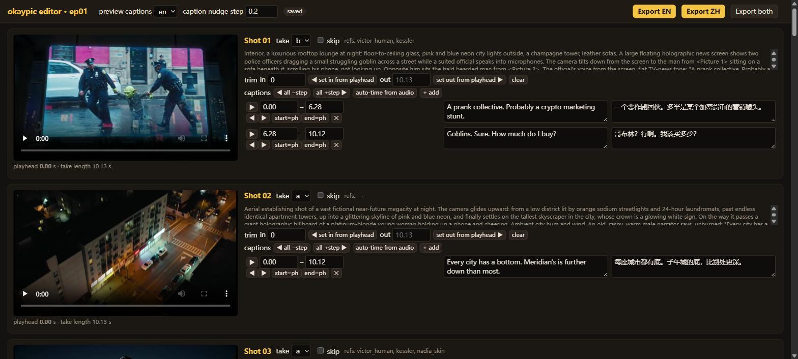

# okaypic-video-skill

A [Claude Code](https://claude.com/claude-code) skill for making short films, episodic series and
ads with AI video through the [okaypic.com](https://okaypic.com) API — plus the small toolchain
we use ourselves: reference sheets, batch rendering, a local editing UI with English/Chinese
captions, and a one-command final cut.

It is the workflow behind **GOBLIN CITY**, an 11-episode urban-legend series whose first episode
(28 shots, ~5 minutes, two takes per shot) cost about US$6 in API calls and an afternoon.
`examples/goblin-city-ep01/` has the real shot list and edit decisions.

```
plan  →  shot list  →  reference sheets  →  takes (H3)  →  pick & cut  →  EN / ZH export
            shots.json      cast.json         gen_clips.py     editor.py       edit.py
```

## Install the skill

```bash
# for one project
git clone https://github.com/okaypic/okaypic-video-skill .claude/skills/okaypic-video
# or for every project
git clone https://github.com/okaypic/okaypic-video-skill ~/.claude/skills/okaypic-video
```

Then in Claude Code: *"use the okaypic-video skill to make a 60-second ad for …"* or just
describe the video you want; the skill triggers on okaypic / AI video requests.

Requirements: Python 3.9+, `ffmpeg` + `ffprobe` on PATH, an okaypic API key
(`OKAYPIC_API_KEY` in the environment or a `.env` file). Get a key and read the API reference at
https://okaypic.com/api-docs .

## Use the scripts without Claude

```bash
export OKAYPIC_API_KEY=...
python scripts/fetch_fonts.py assets              # caption fonts (Noto, OFL)
python scripts/gen_sheets.py ep01                 # cast.json  -> ep01/refs/sheets/*.png
python scripts/gen_clips.py ep01                  # shots.json -> ep01/takes/*.mp4 (+ contact sheets)
python scripts/edit.py ep01 --autotime            # guess caption timings from the audio
python scripts/editor.py ep01                     # local editing UI at http://127.0.0.1:8765
python scripts/edit.py ep01 --lang zh             # or export from the command line
```

## What each piece does

| File | Role |
|---|---|
| `SKILL.md` | The skill: the workflow Claude follows, prompting rules, guardrails |
| `scripts/okaypic_api.py` | Minimal API client: `.env` key, idempotent submits, polling, inline base64 media |
| `scripts/gen_sheets.py` | Character sheets (front/profile close-ups + front/side/back full body) and location sheets from `cast.json` |
| `scripts/gen_clips.py` | Batch MiniMax H3 rendering from `shots.json`: 2 seeds per shot, ≤18 in flight, resumable, 5-frame contact sheet per take |
| `scripts/edit.py` | Final cut: picks, trims, burned-in captions (en/zh), end card, per-clip levelling + −14 LUFS |
| `scripts/editor.py` + `editor.html` | Local editing UI: pick takes, trim, nudge captions while watching, write translations, export |
| `docs/` | File formats, H3 prompting guide, API cheat-sheet, editor manual |
| `examples/goblin-city-ep01/` | A finished episode's `shots.json`, `cast.json`, `edit.json` |

## The editing UI

`python scripts/editor.py ep01` serves a single page from the Python standard library — no npm,
no build step. Every shot is a card: the take video with the live caption overlay, take selector,
skip toggle, trim in/out (type or "set from playhead"), and the caption table with ±step nudges,
"start = playhead" buttons and English / Chinese text side by side. Changes save to `edit.json`
as you type; **Export EN** / **Export ZH** render `<output>_en.mp4` / `<output>_zh.mp4` in the
background and link the result when done.



## Costs (okaypic list prices, Oct 2026)

| Step | Price |
|---|---|
| MiniMax H3 clip, 768p | US$0.01 per second → US$0.10 for 10 s |
| MiniMax H3 clip, 480p | US$0.007 per second |
| Character sheet, GPT Image 2.5 @ 2k | US$0.03 |
| Character sheet, Gemini 3.1 Flash | US$0.02 |

A 25-shot episode at two takes per shot is ~US$5. Failed tasks are refunded; retrying a request
with the same `client_request_id` never charges twice.

## License

MIT. Fonts fetched by `fetch_fonts.py` are Noto (SIL Open Font License).
